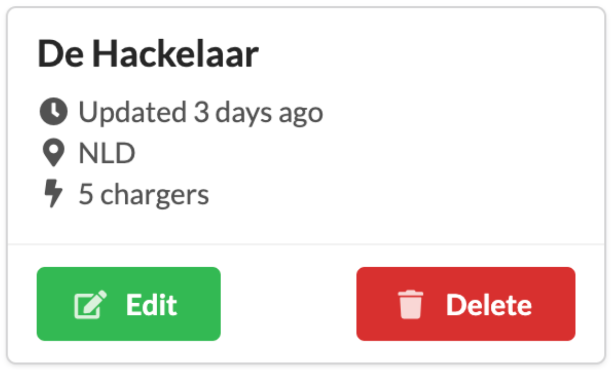

# Software Engineering React Assessment

**This is the Fastned software engineering assessment. The assessment is intended to give us insights into
your technical abilities, engineering approach, and
general technical working habits. We view your
performance on this assessment as indicative of the
work you will deliver as a Fastned software engineer.**

The assessment consists of an assignment to prepare
beforehand and a presentation about your implementation
of the assignment at Fastned’s office or through video
conference.

We expect that you’ll need about 5 to 8 hours to prepare
for the assessment. We ask you to treat the assessment
confidential so we can use it again in the future.

---

## Assignment

In an ongoing push to make the world greener, Fastned is investing in a digital product that provides Fastned employees control over Fastned locations. The Product Owner has passed you some stories and is expecting you to come up with a great solution.

### The stories

* **Location list screen**: As Fastned we want a screen that lists all our locations so we can get an overview of the locations in the network.

* **Add/Edit Location**: As Fastned we want to be able to manage the locations in our network.

* **Add/Edit Charger**: As Fastned we want to be able to add/edit/delete chargers to any of those locations

You can find more details about those screens on the following pages. We love creative ideas and just feel free to come up with your own UI / UX design.

### Location list screen

A screen contains the list of locations. Should have an edit button per item and that button should navigate the user to the Edit view of the selected location. This view should also include an Add location button to be able to create new locations.

**Acceptance Criteria:**

The list should show the following data

* Location Name
* Location No
* Total number of chargers added to the location
* Country (as ISO 3166-1 alpha-3)
* Last updated (as the distance from now such as 3 days ago, 1 min ago, etc.)
* Edit / Remove button to be able to remove a specific location
* Add location button to be able to add a new location
* List should list the items as Card design below in a grid
* Card should be a reusable stateless component

**Card Design:**

This is an example of a location card. Feel free to use any other icons or add your own flavor to the design. **Please make sure that you don’t use any library for this card design. **



### Add location screen

This should be a form screen where users can enter the various details of the location.

Users should also be able to add/edit/remove a charger to a location (if they want) while creating the location.

**Acceptance Criteria:**

The form should show the following inputs

* Location (data model can be found on page 6)
    * Location Name (validation min 3 characters)
    * Location No (validation number only)
    * City (validation min 3 characters)
    * Postal Code (validation only numbers or digits)
    * Country (dropdown)
* Charger (data model can be found on page 6)
    * Status (dropdown)
    * Charger Type (dropdown)
    * Serial Number (validation min 5 characters)

Make sure that user can add/edit or remove a charger while adding a location to the system. Chargers should be part of location data and can not be stored as different entities.

### Edit location screen

This should be a form screen where users can edit various location details.

**Acceptance Criteria:**

The form should show the following inputs

* Location (data model can be found on page 6)
    * Location Name (validation min 3 characters)
    * Location No (validation number only)
    * City (validation min 3 characters)
    * Postal Code (validation only numbers or digits)
    * Country (dropdown)
* Chargers List (data model can be found on page 6)
    * Id
    * Status (dropdown)
    * Charger Type (dropdown)
    * Serial Number (validation min 5 characters)

Make sure that user can add/edit or remove a charger while editing a location in the system. Chargers should be part of location data and can not be stored as different entities.

### Data Models

Locations Model

```
{
  id: number;
  name: string;
  location: number;
  chargers: Charger[];
  postalCode: string;
  lastUpdated: string;
  city: string;
  country: string; // ISO 3166-1 alpha-3
}[]
```

Charger Model

```
{
  id: number;
  type: "HPC" | "T52" | "T53C";
  serialNumber: string;
  status: "CONNECTED" | "NOT_CONNECTED" | "REMOVED";
  lastUpdated: string;
}
```

### Architecture

We love reading README files, especially the ones that have clear instructions on how to start/run the projects. Make sure that anyone with even a tiny bit of experience can successfully run the project by following the readme file.

* Project should be delivered as Git repository
* Project should be done in React
* Use functional components instead of class components
* Project should be written in Typescript
* Project should have ESLint & prettier setup
* Project should use React Queries for the API requests
* Forms should have validation

**Bonus Points**

* Using React Hook Forms
* Adding some tests
* Mobile / tablet support

**How to store the data?**

* You can use a NodeJS / Express server and store the data and have that as a separate project.
* You don't have to deal with any database solutions to handle the data storage
* If you decide to use Redis, Mongo DB, or equivalent to store the data please make sure that you also provide a docker-compose file within the project.

**FAQ**

* Can I use Next JS or equivalent? \
  Yes, feel free to use any SSR framework if you don’t want to deal with multiple projects for the front end and server side.
* Can I use Angular, Vue, or any other framework other than React? \
  No, the project should be done in React.
* Can I use any UI libraries for HTML elements? \
  Yes, you can use any UI library you prefer.
* Can I use Redux, Zustand, or equivalent to manage the data in UI? \
  No, please use React Query
* Can I suppress any ESLint errors? \
  No, but if you have to there should be a proper reason behind it and you should have a comment in the code for that.
